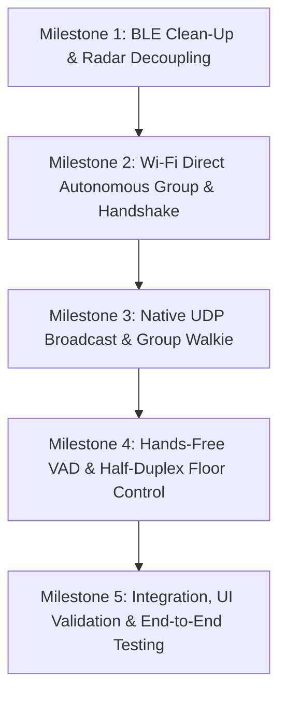

# iTantra Mesh Architecture Refactoring Plan

## Executive Summary
This plan details the systematic restructuring of the iTantra disaster communication stack. It decouples **passive discovery/radar** (BLE advertisements & Wi-Fi Direct service discovery) from **high-bandwidth data transmission** (Wi-Fi Direct P2P + UDP broadcast). It establishes a zero-tap experience for victims under rubble, native 1-to-many group call capabilities, and robust hands-free VAD half-duplex floor control.

---

## Architectural Principles
1. **Decouple Discovery from Connection**:
   - Radar presence and proximity must never require a connection handshake.
   - Beacon broadcasting is connectionless (BLE Manufacturer Data + Wi-Fi Discovery).
2. **Right Transport for the Right Job**:
   - **BLE**: Low-power advertising (24-48h battery life), scanning, and RSSI distance estimation. No GATT loops.
   - **Wi-Fi Direct + UDP**: Long range (100m+), high bandwidth, hands-free VAD voice/text, and 1-to-many group walkie-talkie.
3. **Zero-Tap Victim Guarantee**:
   - SOS mode pre-creates an Autonomous Group Owner silently.
   - Credentials (SSID / Passphrase) are announced via BLE beacon.
   - Rescuer joins using matching credentials; authorization prompts land on the rescuer, never on the victim.
4. **Half-Duplex Floor Arbitration**:
   - Hands-free VAD speech turns are broadcast over UDP (<15ms latency).
   - Receiver `echoGuard` locks the local microphone instantly while loudspeakers or TTS are active, preventing acoustic echo loops.

---

## Milestone Breakdown

---

### Milestone 1: BLE Clean-Up & Radar Decoupling
**Goal**: Strip all remaining GATT connection-on-discovery overhead from the radar path and ensure 100% stable, continuous BLE advertising and scanning.

* **Tasks**:
  1. Audit [BleMeshManager.kt](file:///c:/Users/Ayush%20Kumar/Desktop/LangDataset/iTantra/app/src/main/java/com/itantra/app/mesh/BleMeshManager.kt) to ensure GATT client/server logic is strictly isolated from radar discovery.
  2. Maintain the 24-byte compact [DistressBeaconPayload](file:///c:/Users/Ayush%20Kumar/Desktop/LangDataset/iTantra/app/src/main/java/com/itantra/app/mesh/BleMeshManager.kt#L70-L86) layout (`nodeId`, `battery`, `lat`, `lon`, `altitude`, `language`, `distressFlag`).
  3. Validate watchdog liveness: ensure scan watchdog and advertise watchdog do not cause unnecessary RPA address churn.
  4. Ensure Kalman-filtered RSSI distance estimation in [DistanceEstimator.kt](file:///c:/Users/Ayush%20Kumar/Desktop/LangDataset/iTantra/app/src/main/java/com/itantra/app/mesh/DistanceEstimator.kt) smoothly feeds the Radar UI without flickering.
* **Deliverables**:
  - Radar populated purely via raw `onScanResult` beacon callbacks.
  - Zero GATT connections attempted during search/radar mode.
* **Verification**:
  - Run `DistanceEstimatorTest.kt`.
  - Verify scanner stays alive continuously without restarts or stalls.

---

### Milestone 2: Wi-Fi Direct Autonomous Group & Handshake
**Goal**: Implement the zero-tap connection mechanism for the SOS victim and seamless auto-joining for rescuers.

* **Tasks**:
  1. In [WifiDirectMeshManager.kt](file:///c:/Users/Ayush%20Kumar/Desktop/LangDataset/iTantra/app/src/main/java/com/itantra/app/mesh/WifiDirectMeshManager.kt):
     - Refactor `createGroup()` to use `WifiP2pConfig.Builder` on Android 10+ (API 29+) with predetermined or beacon-broadcast network credentials (`DIRECT-ITANTRA-...` and secure passphrase).
     - Ensure the SOS device pre-creates this group immediately upon distress activation (`startSos()`).
  2. Encode the Wi-Fi group credentials into the BLE beacon or Wi-Fi Direct service TXT record:
     - Rescuers scanning BLE or Wi-Fi Direct automatically acquire the group name and passphrase.
  3. Refactor `connectTo()` in [WifiDirectMeshManager.kt](file:///c:/Users/Ayush%20Kumar/Desktop/LangDataset/iTantra/app/src/main/java/com/itantra/app/mesh/WifiDirectMeshManager.kt#L427-L450):
     - Rescuer connects using the specific group configuration, ensuring the consent prompt remains solely on the rescuer's phone.
  4. Update [MissionControlViewModel.kt](file:///c:/Users/Ayush%20Kumar/Desktop/LangDataset/iTantra/app/src/main/java/com/itantra/app/viewmodel/MissionControlViewModel.kt) state machines to handle group owner vs client transitions cleanly.
* **Deliverables**:
  - Distress mode creates group silently without any popups on the victim device.
  - Rescuers auto-join without requiring the victim to approve connection requests.
* **Verification**:
  - Unit tests for credential framing.
  - Verify `isGroupOwner` and `isGroupFormed` StateFlows transition reliably.

---

### Milestone 3: Native UDP Broadcast & Group Walkie-Talkie
**Goal**: Enable true 1-to-many communication across all connected devices in the Wi-Fi Direct group.

* **Tasks**:
  1. Review UDP socket binding and receive loop in [WifiDirectMeshManager.kt](file:///c:/Users/Ayush%20Kumar/Desktop/LangDataset/iTantra/app/src/main/java/com/itantra/app/mesh/WifiDirectMeshManager.kt#L520-L585):
     - Ensure socket binds to `UDP_PORT` (8889) with `SO_REUSEADDR` and `SO_BROADCAST`.
     - Confirm multicast lock acquisition (`WifiManager.MulticastLock`).
  2. Implement dual-broadcast strategy in `broadcastDatagram()`:
     - Subnet broadcast (`192.168.49.255`).
     - Global broadcast fallback (`255.255.255.255`).
     - Direct unicast to all known peer IPs in `peerIpCache`.
  3. Route all walkie-talkie packets ([PacketFraming.kt](file:///c:/Users/Ayush%20Kumar/Desktop/LangDataset/iTantra/app/src/main/java/com/itantra/app/mesh/PacketFraming.kt)) through UDP broadcast:
     - `MSG_TYPE_DISTRESS_BEACON`
     - `MSG_TYPE_TRANSLATED_TEXT` (Text Transceiver model)
     - `MSG_TYPE_VOICE_FRAME` (PCM voice frames if active)
     - `MSG_TYPE_PROFILE`
* **Deliverables**:
  - Single transmission reaches all group participants concurrently.
  - Zero serial delivery bottlenecks; no connection limits.
* **Verification**:
  - Test packet encoding/decoding with `PacketFramingTest.kt`.
  - Simulate multi-peer UDP reception.

---

### Milestone 4: Hands-Free VAD & Half-Duplex Floor Control
**Goal**: Ensure hands-free voice detection works seamlessly with speaker playback suppression to prevent acoustic feedback loops.

* **Tasks**:
  1. In [AudioCaptureEngine.kt](file:///c:/Users/Ayush%20Kumar/Desktop/LangDataset/iTantra/app/src/main/java/com/itantra/app/audio/AudioCaptureEngine.kt) & [VoiceTurnCoordinator.kt](file:///c:/Users/Ayush%20Kumar/Desktop/LangDataset/iTantra/app/src/main/java/com/itantra/app/audio/VoiceTurnCoordinator.kt):
     - Verify VAD energy threshold (`SPEECH_TRIGGER_DB = 5.5`) and adaptive noise floor.
     - Ensure minimum turn duration (200ms) discards transient clicks, and maximum turn duration (8.0s) triggers timely flushes.
  2. Solidify `echoGuard` in [MissionControlViewModel.kt](file:///c:/Users/Ayush%20Kumar/Desktop/LangDataset/iTantra/app/src/main/java/com/itantra/app/viewmodel/MissionControlViewModel.kt#L2716-L2746):
     - Whenever TTS or audio playback starts, set `echoGuardUntil = now + duration + decayMs`.
     - Strictly gate mic capture while `isEchoGuardActive()` is true.
  3. Implement floor state notifications:
     - When receiving inbound speech from a peer over UDP, immediately assert remote-speaker active state.
     - Lock out local VAD triggers until remote transmission and local playback finish.
* **Deliverables**:
  - Clear, hands-free voice detection without accidental self-transmission.
  - Half-duplex arbitration across all group members.
* **Verification**:
  - Run `VoiceStreamGateTest.kt`.
  - Test acoustic echo suppression edge cases.

---

### Milestone 5: Integration, UI Validation & End-to-End Testing
**Goal**: Validate that all screens (Radar, Walkie, SOS, Rescue, Settings) reflect real-time link states and telemetry correctly.

* **Tasks**:
  1. Verify [RescueScreen.kt](file:///c:/Users/Ayush%20Kumar/Desktop/LangDataset/iTantra/app/src/main/java/com/itantra/app/ui/screens/RescueScreen.kt) radar compass:
     - Compass bearing rotates smoothly with device magnetometer.
     - Distance accurately reflects fused GPS + BLE RSSI.
  2. Verify [WalkieScreen.kt](file:///c:/Users/Ayush%20Kumar/Desktop/LangDataset/iTantra/app/src/main/java/com/itantra/app/ui/screens/WalkieScreen.kt):
     - Displays transmitting/receiving state, live audio meters, and participant list.
  3. Verify [SosDistressScreen.kt](file:///c:/Users/Ayush%20Kumar/Desktop/LangDataset/iTantra/app/src/main/java/com/itantra/app/ui/screens/SosDistressScreen.kt):
     - Background beaconing operates silently while device is locked.
  4. Run full test suite and Gradle build validation:
     - `./gradlew.bat compileDebugKotlin`
     - `./gradlew.bat test`
* **Deliverables**:
  - Production-ready APK build with zero compiler warnings or lint errors.
  - Complete, reliable emergency mesh stack.

---

## Risk Management & Fallback Strategies
| Risk | Potential Impact | Mitigation |
| :--- | :--- | :--- |
| **OEM Wi-Fi Direct Inconsistency** | Some devices reject custom SSID/passphrase in `createGroup` | Fall back to standard `createGroup()` and broadcast the system-generated SSID via BLE. |
| **No GPS Indoors** | Direction angle becomes unavailable | Radar displays proximity distance ring (concentric circles) driven by BLE RSSI. |
| **High Radio Congestion (2.4 GHz)** | BLE scan packets dropped during Wi-Fi transmission | Throttle UDP presence broadcast cadence (e.g. 3-5s) so the radio has clear air time for BLE scan/advertising. |
